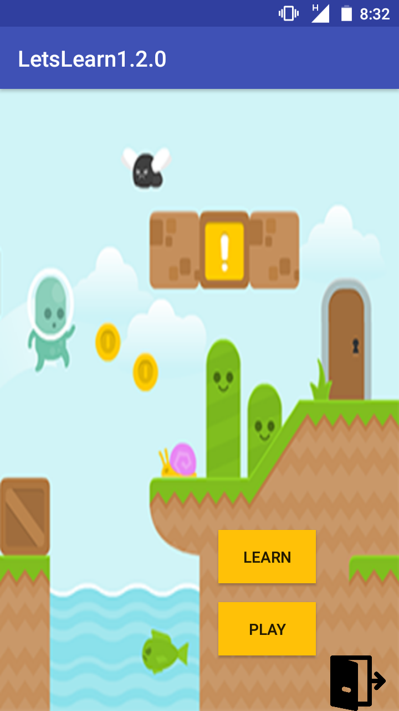
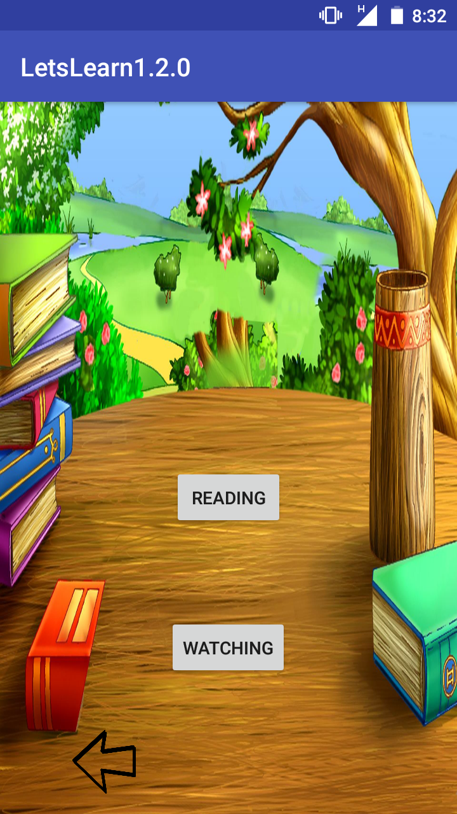
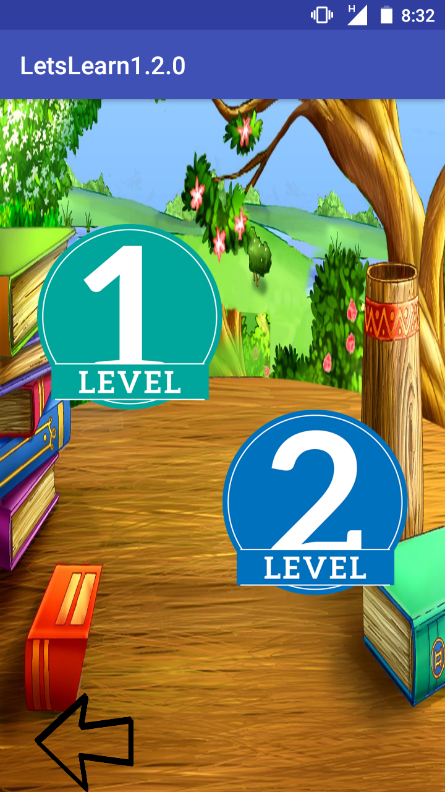
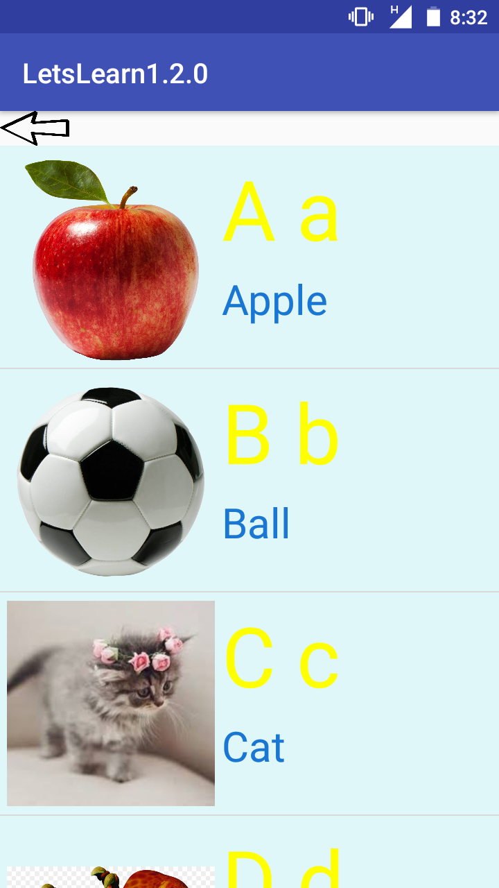
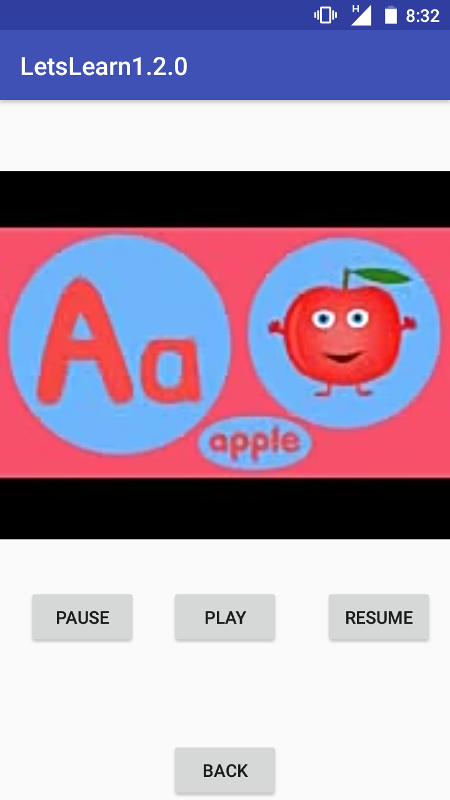
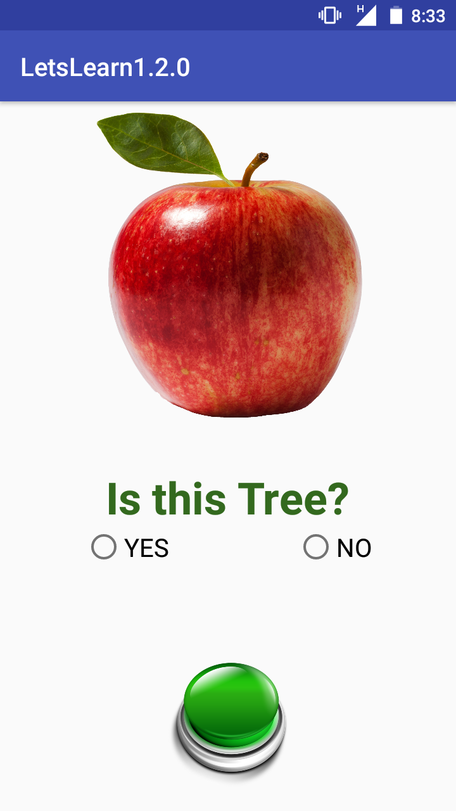
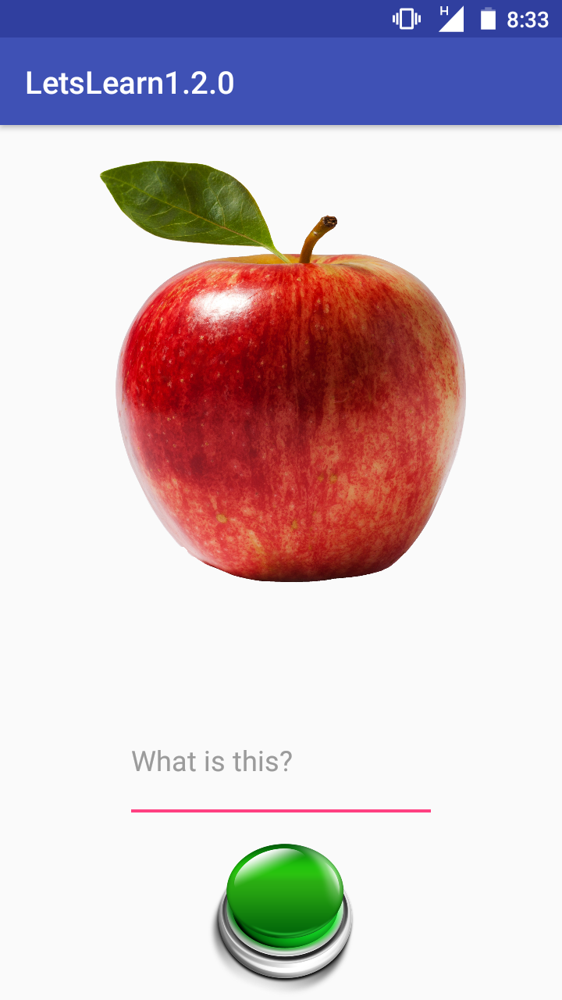
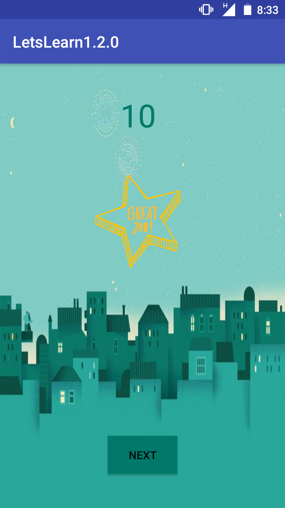
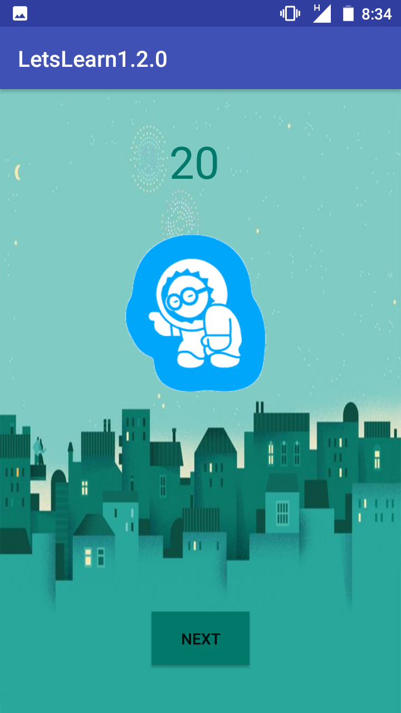

# Android app for A-L-P-H-A-B-E-T learning 

## Here is the flow of the App with Screenshoots

 

### Learning through Reading or Singing: 
 

### Levels One and Two: 
                

### Right answer Vs Wrong answer:
                

